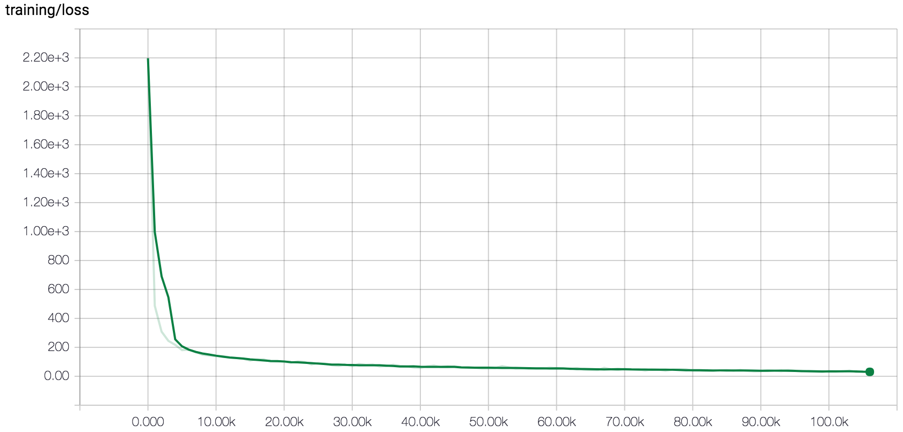

# speechT
An opensource speech-to-text software written in tensorflow.
Achieving a **Letter Error Rate of 8%** and **Word Error Rate of 20%** on the [LibriSpeech](http://www.openslr.org/12/) test corpus.

## Installation

### Prerequisites

Python3, portaudio19-dev and ffmpeg are required.

On Ubuntu install via
```
sudo apt install python3-pip portaudio19-dev ffmpeg
```

### Install via pip3

```
pip3 install git+https://github.com/timediv/speechT
```

## Architecture
Currently speechT is based on the [Wav2Letter paper](https://arxiv.org/abs/1609.03193) and the CTC loss function.

The speech corpus from http://www.openslr.org/12/ is automatically downloaded.  
**Note:** The corpus is about 30GB!

## Training
The data must be preprocessed before training
```
speecht-cli preprocess
```

Then, to run the training, execute
```
speecht-cli train
```

Use `--help` for more details.

You can monitor the training and see other logs in [tensorboard](https://www.tensorflow.org/get_started/summaries_and_tensorboard)
```
tensorboard --logdir log/
```

## Testing

To evaluate on the whole test set run
```
speecht-cli evaluate
```

To evaluate on a single batch
```
speecht-cli evaluate --step-count 1
```

By default greedy decoding is used.
See section `Using a language model` on how to use KenLM for decoding.

Use `--help` for more details.

## Live usage

To record using your microphone and then print the prediction run
```
speecht-cli record
```

Use `--help` for more details.

## Trained weights

You don't have the resources to train on your own?
Download the weights from [here](https://github.com/timediv/speechT/releases/download/v1.0/speechT-weights.tgz)

```commandline
mkdir train
tar xf speechT-weights.tgz -C train/
```

Then you can use the model with e.g. evaluate
```commandline
speecht-cli evaluate --run-name best_run
```

## Using a language model

If you'd like to use KenLM as a language model for decoding you need to compile and install [tensorflow-with-kenlm](https://github.com/timediv/tensorflow-with-kenlm).

Download all the necessary files from [here](https://github.com/timediv/speechT/releases/download/v1.0/kenlm-english.tgz), then
```commandline
tar xf kenlm-english.tgz
speecht-cli evaluate --language-model kenlm-english/
```

## Results

With the default parameters trained for about 5 to 6 days on a Nvidia Titan X.



Overall statistics
```
Average Letter Edit Distance: 7.7125
Average Letter Error Rate: 8%
Average Word Edit Distance: 3.801953125
Average Word Error Rate: 20%
```

LER, WER and predictions on a few examples
```
expected: but that is kaffar's knife
decoded: but that is caffr's klife 
LED: 4 LER: 0.15 WED: 2 WER: 0.40

expected: he moved uneasily and his chair creaked
decoded: he moved uneasily in his chair creet
LED: 5 LER: 0.13 WED: 2 WER: 0.29

expected: it is indeed true that the importance of tact and skill in the training of the young and of cultivating their reason and securing their affection can not be overrated
decoded: it is indeed true that the importance of tact and skill in the training of the young and of cultivating their reason and so carrying their affection can not be o rated
LED: 8 LER: 0.05 WED: 4 WER: 0.13

expected: she pressed his hand gently in gratitude
decoded: she pressed his hand gently in gratitude
LED: 0 LER: 0.00 WED: 0 WER: 0.00

expected: don't worry sizzle dear it'll all come right pretty soon
decoded: don't worry i l dear it all come riprety soon 
LED: 13 LER: 0.23 WED: 5 WER: 0.50

expected: may we see gates at once asked kenneth
decoded: may we see gates at once asked keneth 
LED: 2 LER: 0.05 WED: 1 WER: 0.12

```

The whole evaluation log can be found [here](https://github.com/timediv/speechT/releases/download/v1.0/test-corpus-evaluation.txt).